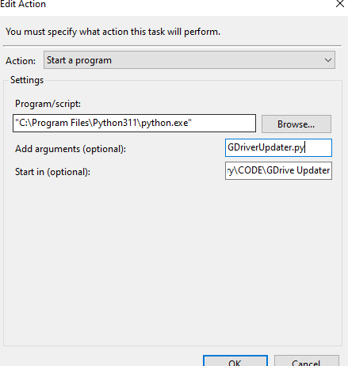
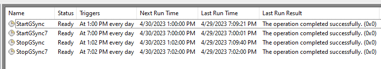

# Google Drive Task Scheduler

This script is used in combination with a task schedule event on my personal Windows computer to run Google Drive Sync at 1pm and 7pm during the day. 

# Why I made this

The main motivation for making this script was that I didn't need Google Drive to constantly be checking for new files to upload and sync to my drive; I am fine with a bi-daily update. In addition, synced files have a checkmark at the bottom of their icon which I didn't really care for when Google Drive is enabled on my machine.

Additionally again, Google Drive automatically updates which means the folder it is in changes. I could have used some regex to bypass this, but I then realized that os.startfile only lets the file run as long as the program is open.

# The Simplest Solution

Start the Shortcut in the Start Menu to Google Drive. That does the trick. Add a task in Windows task scheduler like this:

And then some taskkills 2 minutes after and viola!

